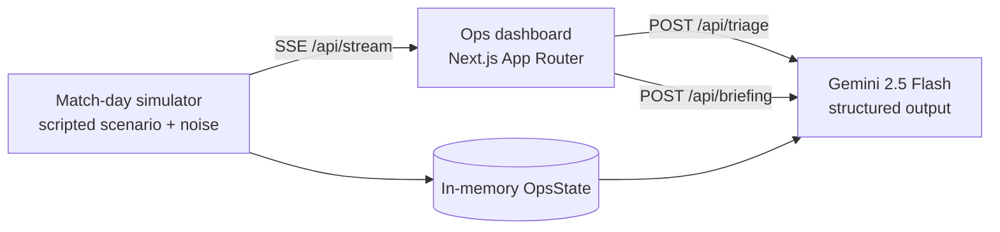

# MatchDay Command 🏟️

**AI incident command copilot for smart stadiums and tournament operations.**

Built solo for **Google PromptWars** (theme: Smart Stadiums & Tournament Operations). While most stadium AI targets fans, MatchDay Command sits on the other side of the glass — in the operations control room. Live gate, crowd, radio, medical, and weather signals stream into one dashboard; **Gemini** triages incidents, recommends staff actions, and writes the operational briefings and shift-handover reports that ops teams produce by hand today.

## Why this matters

Running 104 World Cup matches across 16 stadiums pushed real tournaments toward digital twins and predictive crowd management. The expensive part isn't the sensors — it's the human bottleneck: an ops room drowning in radio chatter and dashboards, making judgment calls under pressure. MatchDay Command demonstrates that a well-prompted LLM can carry the cognitive load: *cluster the noise into incidents, explain the risk, propose the next action, and write it all down.*

## What it does

1. **Live signal feed** — a match-day simulator streams gate throughput, crowd density, steward radio logs, medical calls, and weather over SSE. (Simulated data means the demo never depends on hardware or third-party APIs.)
2. **AI incident triage** — one click sends an incident plus its source telemetry to Gemini, which returns structured output: severity, rationale, prioritized actions assigned to radio channels, and an escalation flag.
3. **Ops briefings & handovers** — Gemini drafts the periodic situation briefing and the end-of-shift handover report from the event log.

## Architecture



Everything shares one vocabulary: the types in [`src/shared/models/`](src/shared/models/) define events, incidents, briefings, and the SSE wire protocol — used by the simulator, the API routes, and the UI alike. See [`docs/ARCHITECTURE.md`](docs/ARCHITECTURE.md) for the full design.

## Tech stack

- **Next.js 15** (App Router, TypeScript, Tailwind v4) — one full-stack app
- **Gemini API** (`@google/genai`, structured JSON output)
- **Server-Sent Events** for the live feed
- **Cloud Run** for deployment (Docker, standalone output)

## Getting started

```bash
npm install
cp .env.example .env.local   # add your Gemini API key (free at aistudio.google.com/apikey)
npm run dev                  # http://localhost:3000
```

Useful checks: `npm run typecheck`, `npm run build`.

## Deploy to Cloud Run

```bash
gcloud run deploy matchday-command --source . --region asia-south1 \
  --allow-unauthenticated --max-instances 1 \
  --set-env-vars GEMINI_API_KEY=<your-key>
```

(`--max-instances 1` because match-day state is in-memory by design — see `src/lib/store.ts`.)

## Roadmap

- [x] Shared domain models + SSE protocol
- [x] Simulator skeleton with scripted match-day scenario
- [x] Gemini triage endpoint (structured output)
- [ ] Live ops dashboard (zones, gates, incident feed)
- [ ] Incident detection rules (density/queue thresholds → auto-open incidents)
- [ ] Briefing + shift handover generation
- [ ] Baseline simulator noise (arrival curves) so anomalies pop
- [ ] Cloud Run deployment + demo link here

## License

[MIT](LICENSE)
