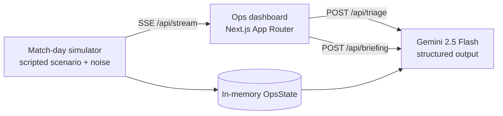

# MatchDay Command 🏟️

**AI incident command copilot for smart stadiums and tournament operations.**

**Live demo:** https://matchday-command-1069049902747.asia-south1.run.app

Built solo for **Google PromptWars** (theme: Smart Stadiums & Tournament Operations). While most stadium AI targets fans, MatchDay Command sits on the other side of the glass — in the operations control room. Live gate, crowd, radio, medical, and weather signals stream into one dashboard; **Gemini** triages incidents, recommends staff actions, and writes the operational briefings and shift-handover reports that ops teams produce by hand today.

## Why this matters

Running 104 World Cup matches across 16 stadiums pushed real tournaments toward digital twins and predictive crowd management. The expensive part isn't the sensors — it's the human bottleneck: an ops room drowning in radio chatter and dashboards, making judgment calls under pressure. MatchDay Command demonstrates that a well-prompted LLM can carry the cognitive load: *cluster the noise into incidents, explain the risk, propose the next action, and write it all down.*

The app has **three views on one shared live match**: the **ops control room** (`/`), the **staff console** (`/staff`), and the **tournament supervisor** (`/tournament`). One server-side simulation broadcasts to every client — all screens show the same clock and story, and sim controls (speed / next-beat / restart) are global.

## What it does

1. **Live signal feed** — a match-day simulator streams gate throughput, crowd density, steward radio logs, medical calls, and weather over SSE. (Simulated data means the demo never depends on hardware or third-party APIs.)
2. **AI incident triage** — one click sends an incident plus its source telemetry to Gemini, which returns structured output: severity, rationale, prioritized actions assigned to radio channels, and an escalation flag.
3. **Ops briefings & handovers** — Gemini drafts the periodic situation briefing and the end-of-shift handover report from the event log.
4. **Approach traffic & routing** — a live **Google Map** with real-time traffic (when a Maps key is present; a schematic fallback otherwise) shows approach-corridor congestion, parking-lot fill, and AI-style routing advisories ("steer arrivals to Ring Road, direct parking to Lot C").
5. **Weather-driven demand forecasting** — real forecast via **Open-Meteo** (keyless) feeds Gemini, which predicts supply demand (umbrellas, ponchos, water, cold drinks, hot food, fans, blankets) against on-hand stock and flags shortfalls.
6. **Staff dispatch console** — the system doesn't just watch, it *acts*: prep/stocking orders, traffic advisories, weather readiness, and incident response are dispatched as role-grouped tasks with an ack → in-progress → done lifecycle.
7. **Control-room copilot (agentic)** — a chat that answers from live state *and takes actions via Gemini function calling*: "tell catering to start hot food prep" dispatches a real task to the staff console; it can also open incidents and trigger briefings.
8. **Predictive early warnings** — trend projection over live telemetry warns *before* thresholds break: "North Concourse on track to hit 85% in ~9 min" — with one-click pre-emptive incident creation.
9. **Voice radio reports** — push-to-talk (browser Web Speech API, keyless): a spoken steward report lands in the live feed and flows into AI triage like any other signal.
10. **Tournament supervisor** — every venue on one wall: the live stadium plus sister venues with staggered kickoffs, aggregate incident counts, and a highest-pressure ranking.
11. **Emergency mode** — a guarded red button flips the venue to evacuation posture: gates go exit-only, Gemini writes the zone-by-zone evacuation plan **and** the PA announcement, and work orders are auto-dispatched to every staff role.

## Architecture



Everything shares one vocabulary: the types in [`src/shared/models/`](src/shared/models/) define events, incidents, briefings, and the SSE wire protocol — used by the simulator, the API routes, and the UI alike. See [`docs/ARCHITECTURE.md`](docs/ARCHITECTURE.md) for the full design.

## Tech stack

- **Next.js 15** (App Router, TypeScript, Tailwind v4) — one full-stack app
- **Gemini API** (`@google/genai`, structured JSON output) — triage, briefings, demand forecasting
- **Google Maps Platform** (Maps JavaScript API + live TrafficLayer) — approach traffic, with a keyless SVG fallback
- **Open-Meteo** (free, keyless) — live weather, with a simulated fallback
- **Server-Sent Events** for the live feed
- **Cloud Run** for deployment (Docker, standalone output)

### Environment variables

| Var | Purpose | Required |
|---|---|---|
| `GEMINI_API_KEY` | Triage, briefings, demand (Gemini) | Yes for AI features |
| `GEMINI_MODEL` | Model id (default `gemini-3.5-flash`) | No |
| `MAPS_API_KEY` | Google Maps live traffic; delivered to the client at runtime via `/api/config`. Without it, the map degrades to a schematic. | No |

Everything degrades gracefully: with no keys at all, the feed, map (schematic), and dashboards still work — only the Gemini-backed panels surface an error.

## Getting started

```bash
npm install
cp .env.example .env.local   # add your Gemini API key (free at aistudio.google.com/apikey)
npm run dev                  # http://localhost:3000
```

Useful checks: `npm run typecheck`, `npm run build`.

## Deploy to Cloud Run

```bash
gcloud run deploy matchday-command --source . --region asia-south1 \
  --allow-unauthenticated --max-instances 1 \
  --set-env-vars GEMINI_API_KEY=<your-key>
```

(`--max-instances 1` because match-day state is in-memory by design — see `src/lib/store.ts`.)

## Roadmap

- [x] Shared domain models + SSE protocol
- [x] Simulator with scripted match-day scenario + baseline arrival curves
- [x] Gemini triage endpoint (structured output)
- [x] Live ops dashboard (zone density meters, gate tiles, event ticker, incident queue)
- [x] Incident detection rules (density/queue/medical/weather → auto-open incidents)
- [x] Briefing + shift handover generation
- [x] Cloud Run deployment ([live demo](https://matchday-command-1069049902747.asia-south1.run.app))
- [x] Judge-facing replay controls (deterministic "next beat" fast-forward) + report export
- [x] Mobile layout (incidents above feed, stacked panels)
- [x] Approach traffic map (Google Maps live traffic + schematic fallback)
- [x] Weather-driven demand forecasting (Open-Meteo + Gemini)
- [x] Staff dispatch console (`/staff`) with role-grouped task board
- [x] Agentic copilot chat (Gemini function calling → open incidents, dispatch tasks, briefings)
- [x] Predictive early warnings (trend projection ahead of threshold breaches)
- [x] Push-to-talk voice radio reports (Web Speech API)
- [x] Shared live match state (one server-side sim, all views on the same clock, global controls)
- [x] Tournament supervisor view (`/tournament`)
- [x] Emergency mode (AI evacuation plan + PA text + auto-dispatched staff orders)

## License

[MIT](LICENSE)
